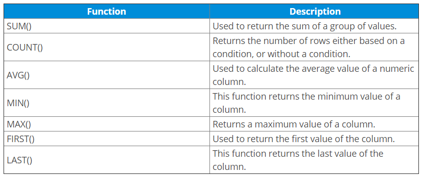

# Aggregate and Scalar Functions
**Functions** are methods used to perform data operations. SQL has many in-built functions used to perform string concatenations, mathematical calculations etc.

SQL functions are categorized into the following two categories:
1. **Aggregate Functions**
2. **Scalar Functions**

### What's the main difference between Scalar & Aggregate Functions?
**Aggregate** and **Scalar functions** both return a single value but **Scalar functions** operate based on a single input value argument while **Aggregate functions** operate on a single input set of values (a collection or column name).

## Aggregate Functions
Aggregate Functions in SQL perform calculations on a group of values and then return a single value. Following are a few of the most commonly used Aggregate Functions:



### Example:
In order to run some aggregate functions on data, let's populate a dummy database using a realistic data generator called [Mockaroo](https://www.mockaroo.com/).

1. Create a new Postgres connection on `localhost` and open an empty SQL editor.

2. Run the following code in your editor:
```sql
CREATE TABLE students (
	student_id SERIAL PRIMARY KEY,
	first_name VARCHAR(50),
    last_name VARCHAR(50),
	marks INT
);
```

3. Insert the following data into your table to populate your tables with dummy data:
```sql
INSERT INTO students (first_name, last_name, marks) VALUES ('Rubetta', 'Arnault', 71);
INSERT INTO students (first_name, last_name, marks) VALUES ('Pavlov', 'Gedney', 77);
INSERT INTO students (first_name, last_name, marks) VALUES ('Pauline', 'Cruess', 61);
INSERT INTO students (first_name, last_name, marks) VALUES ('Gustav', 'Lambeth', 81);
INSERT INTO students (first_name, last_name, marks) VALUES ('Garey', 'Goulding', 96);
INSERT INTO students (first_name, last_name, marks) VALUES ('Sidonnie', 'Lofthouse', 63);
INSERT INTO students (first_name, last_name, marks) VALUES ('Vicki', 'Mardling', 87);
INSERT INTO students (first_name, last_name, marks) VALUES ('Michal', 'Londsdale', 61);
INSERT INTO students (first_name, last_name, marks) VALUES ('Hephzibah', 'Gealy', 76);
INSERT INTO students (first_name, last_name, marks) VALUES ('Cherrita', 'Theuff', 66);
INSERT INTO students (first_name, last_name, marks) VALUES ('Shandee', 'Dell Casa', 83);
INSERT INTO students (first_name, last_name, marks) VALUES ('Pedro', 'Collister', 95);
INSERT INTO students (first_name, last_name, marks) VALUES ('Adam', 'Petkovic', 68);
INSERT INTO students (first_name, last_name, marks) VALUES ('Margaux', 'Drinkale', 95);
INSERT INTO students (first_name, last_name, marks) VALUES ('Helene', 'Disbrow', 67);
INSERT INTO students (first_name, last_name, marks) VALUES ('Sigismundo', 'Gomery', 93);
INSERT INTO students (first_name, last_name, marks) VALUES ('Tobi', 'Loukes', 79);
INSERT INTO students (first_name, last_name, marks) VALUES ('Lemar', 'Warburton', 78);
INSERT INTO students (first_name, last_name, marks) VALUES ('Dorree', 'Sweedy', 98);
INSERT INTO students (first_name, last_name, marks) VALUES ('Duke', 'Kendrew', 75);
```

4. We can now run Aggregate functions against this data to return a single value from all of the data stored within a particular column.  Run the following `AVG()` aggregate function to return the average mark from the `marks` column:

```sql
SELECT AVG(marks)
FROM students;
```
This should return `78.5` as the average grade within the students table.

5. Experiment with other functions such as `MAX()`, `MIN()`.

6. `COUNT()` returns the number of rows present in the table based on a particular condition define by the `where` clause. For example:
```sql
SELECT COUNT(student_id)
FROM students
WHERE marks > 75;
```

## Scalar Functions
Scalar Functions are used to return a single value from *user* input.  PSQL supports scalar functions that may be included in a SQL statement as a primary expression.

Scalar Fucntions in PSQL can be divided into the following categories:
* **String Functions**
    * `LOWER(string)`: Converts all upper case characters in string to lower case.
    * `CONCAT(string1, string2)`: Returns a string that results from combining string1 and string2.
    * `LENGTH(string)`: Returns the number of characters in string
    * `SUBSTRING(string1, start, length)` : Returns a character string derived from string1 beginning at the 

* **Numeric Functions**
    * `ROUND (numeric_exp, integer_exp)`: Returns numeric_exp rounded to integer_exp places right of the decimal point. 
    * `MOD (integer_exp1, integer_exp2)`: Returns the remainder (modulus) of integer_exp1 divided by integer_exp2.

* **Time and Date Functions**
    * `CURDATE( )`: Returns the current local date in the format 'yyyy-mm-dd'. Uses the local clock time by default. 
    * `NOW()`: Returns the current local date and time as a time stamp value in this format: `yyyy-mm-dd hh:mm:ss.mmm`

* **Conversion Functions, etc...**

>You can find a complete list of PSQL Scalar Functions [here](https://docs.actian.com/psql/psqlv13/index.html#page/sqlref/scalarfunc.htm#ww1138742)


### Example:
The following demos will continue to utilize the dummy data that we've built in our current database:

1. Write a query to retrieve the names of all students in lowercase:
```sql
SELECT LOWER(first_name)
FROM students;
```

2. Write a query to extract a substring of a particular record:
```sql
SELECT SUBSTRING(first_name,2, 3) 
FROM students WHERE first_name = 'Pavlov';
```

### References:
* [PSQL Scalar Functions](https://docs.actian.com/psql/psqlv13/index.html#page/sqlref/scalarfunc.htm)
