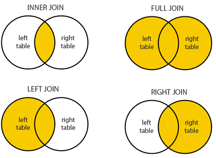

# JOINs
A `JOIN` clause is used to combine rows from two or more tables, based on a related column between them.

## Different Types of SQL JOINs

* `(INNER) JOIN`: Returns records that have matching values in both tables
* `LEFT (OUTER) JOIN`: Returns all records from the left table, and the matched records from the right table
* `RIGHT (OUTER) JOIN`: Returns all records from the right table, and the matched records from the left table
* `FULL (OUTER) JOIN`: Returns all records when there is a match in either left or right table
* `CROSS JOIN`: Matches every row of the first table with every row of the second table. 
    * Note: A cross join can also be accomplished with the following syntax: `SELECT * FROM table_a, table_b;`




## Example:
The following joins examples will use the table that we built in the [Sublanguages Examples](https://gitlab.com/revature_training/postgres-team/-/blob/master/postgres-sql-standard-examples/phase-1/sublanguages-constraints-examples.md)

1. Count users with the greatest number of posts:

```sql
SELECT users.id, first_name, last_name, count(*) AS count_num FROM users
		LEFT JOIN posts ON posts.author_id = users.id
		GROUP BY users.id
	ORDER BY count_num DESC;

```

2.  Select the most liked posts I want the top 10 most liked posts ordered from most liked to least liked:

```sql
--In our case, a right join is effectively an inner join
SELECT COUNT(*) FROM users
		RIGHT JOIN posts ON users.id = posts.author_id;
```

3. Create a view from a query:

```sql
CREATE VIEW most_posts AS SELECT users.id, first_name, last_name, COUNT(*) AS count_num FROM users
		LEFT JOIN posts ON posts.author_id = users.id
		GROUP BY users.id
	ORDER BY count_num DESC;

    SELECT * FROM most_posts WHERE id > 500;
```

## Task:
* Create the model for your banking application.
* Create a ERD to represent your model. ERD -> Entity Reliational Diagram
* Define all PKs, FKs, define multiplicity between tables/entities.
* Define all constraints necessary to weed out invalid data and mantain referential integrity.
* Define common ways data might be joined and define views to access those.


### References:
* [PSQL JOINs](https://www.tutorialspoint.com/postgresql/postgresql_using_joins.htm#:~:text=Advertisements,The%20CROSS%20JOIN)