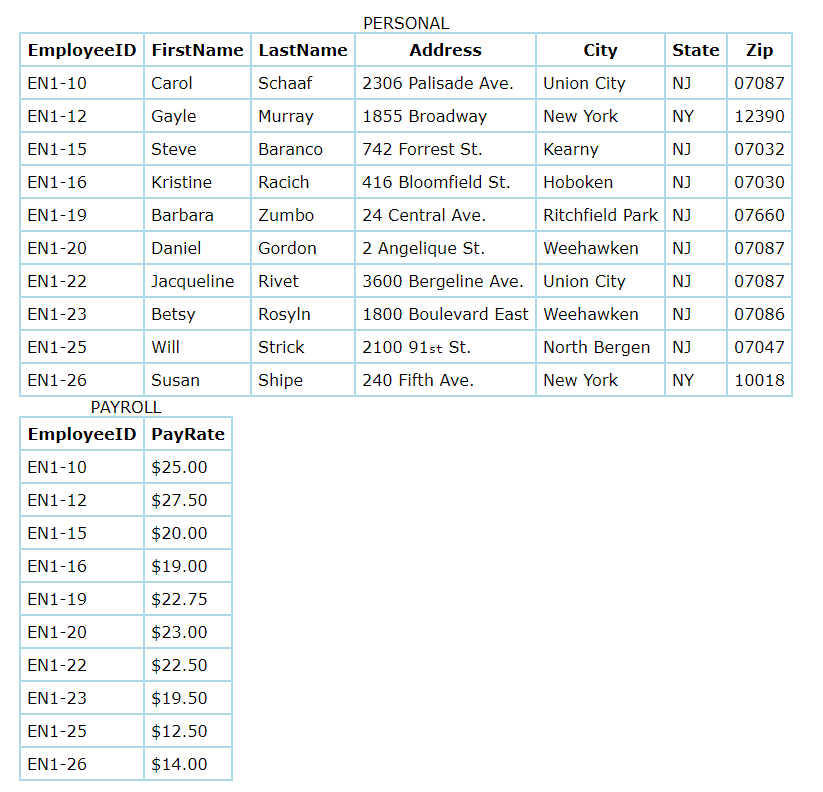
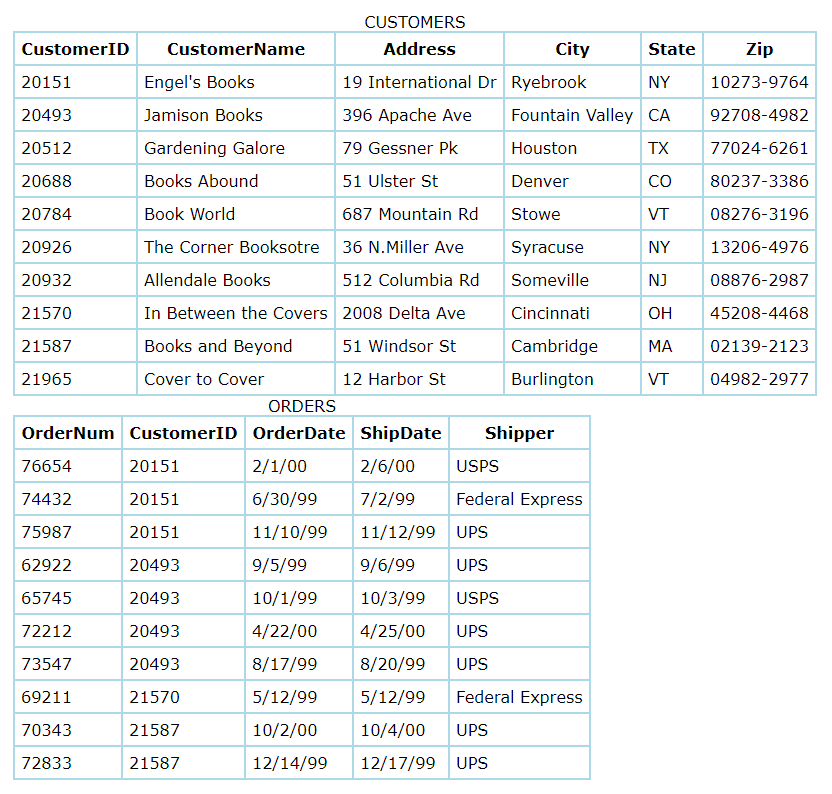

# Multiplicity (Cardinality)
There are three types of relationships between data within separate tables: **one-to-one**, **one-to-many**, and **many-to-many**. To be able to identify these relationships, you need to examine the data and have an understanding of what business rules apply to the data and tables. One table is called the primary or parent table and the other is the related or child table.

### One-to-One Relationship
A *one-to-one* (1:1) relationship means that each record in Table A relates to one, and only one, record in Table B, and each record in Table B relates to one, and only one, record in Table A. Look at the following example of tables from a company's Employees database:



>Each record in the Personal table is about one employee. That record relates to one, and only one, record in the Payroll table. Each record in the Payroll table relates to one, and only one, record in the Personal table. **In a one-to-one relationship, either table can be considered to be the primary or parent table.**

### One-To-Many Relationship
A *one-to-many* (1:N) relationship means a record in Table A can relate to zero, one, or many records in Table B. Many records in Table B can relate to one record in Table A. The potential relationship is what's important; for a single record in Table A, there might be no related records in Table B, or there might be only one related record, but there could be many. Look at the following tables about a company's Customers and Orders.



>The Customers table holds a unique record for each customer. Each customer can place many orders. Many records in the Orders table can relate to only one record in the Customers table. This is a one-to-many relationship (1:N) between the Customers table and the Orders table. **In a one-to-many relationship, the table on the one side of the relationship is the primary table and the table on the many side is the related table.**

### Many-To-Many Relationship
Examine the sample data below. These tables hold data about employees and the projects to which they are assigned. Each project can involve more than one employee and each employee can be working on more than one project. This constitutes a **many-to-many** (N:N) relationship.


## Example: Mapping Many-to-Many
Friend-like relationship involves two users, but we can't use the user entity alone to map this relationship, so we need a `JUNCTION TABLE`.

1. Run the following code in your script:

```sql
CREATE TABLE friends (
	friend1 INTEGER REFERENCES users(id),
	friend2 INTEGER REFERENCES users(id),
	PRIMARY KEY (friend1, friend2) -- implicitly NOT NULL and UNIQUE
);

INSERT INTO friends (friend1, friend2) VALUES
(2, 7), (4, 5), (1, 5), (2, 1), (2, 5), (7, 4);
```

* `IN` keyword to in a `WHERE` clause to match any value in a set of values.
* A subquery can be supplied to provide a result set for a `SET` in a `WHERE` clause.
* The subquery acting as set should include only one column per row.
* `UNION` will combine multiple result sets into a single result.
* `UNION ALL` will include duplicate.

```sql

SELECT first_name, last_name FROM users WHERE id IN
(SELECT friend1 FROM friends WHERE friend2 = 7
UNION
SELECT friend2 FROM friends WHERE friend1 = 7);

SELECT * FROM users;
```


### References
* [Database Relationships](https://vladmihalcea.com/database-table-relationships/)
