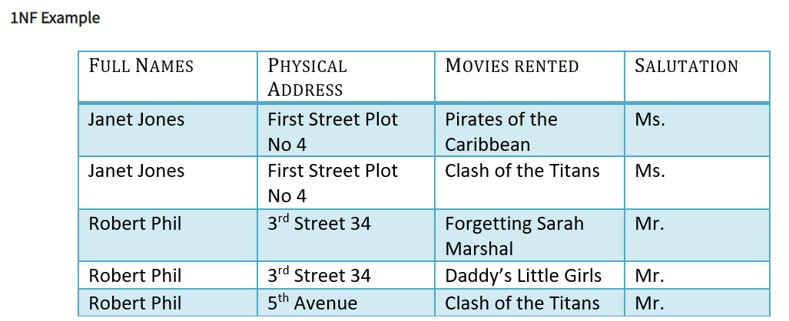

# Normalization
Normalization is a database design technique that reduces data redundancy and eliminates undesirable characteristics like Insertion, Update and Deletion Anomalies. 

* Normalization divides larger tables into smaller tables and links them using relationships. 
* The purpose of Normalization is to eliminate redundant data and ensure data is stored logically.

### All Normal Forms & Their Rules
Associates only need to know up to 3NF.

* **1NF (First Normal Form)**: 
    * Each table cell should contain a single value.
    * Each record needs to be unique.

 &nbsp;

&nbsp;&nbsp;&nbsp;&nbsp;

* **2NF (Second Normal Form)**:
    * Be in 1NF.
    * Single column primary key.  (No partial dependencies)


>In order to achieve 2NF from the first table, we have divided it into two tables.  Table 1 contains member information. Table 2 contains information on movies rented. In order to put this table into 2NF, we have created a new column called `Membership_ID` which is the **primary key** for Table 1. Records can be uniquely identified in Table 1 using `Membership_ID`.

> In Table 2, `Membership_ID` is the **foreign key**. &nbsp;&nbsp;&nbsp;

&nbsp;&nbsp;&nbsp;
* **3NF (Third Normal Form) Rules** 
    * Be in 2NF.
    * Has no transitive dependencies.


>We have again divided our tables and created a new table which stores `Salutations`. There are no transitive functional dependencies, and hence our table is in 3NF.  In Table 3 `Salutation_ID` is **primary key**, and in Table 1 `Salutation ID` is **foreign to primary key** in Table 3.

&nbsp;&nbsp;
## Normalization Demo in DBeaver:

1. First we will create a `customers` table that is NOT in 1NF because the name attribute is not atomic in nature.  The Name could be broken into first name, last name - or first name, middle name, last name, etc.  Run the following:

```sql
CREATE TABLE IF NOT EXISTS customers (
	id SERIAL PRIMARY KEY,
	name VARCHAR(40), -- Could fix by breaking this column into several atomic columns (i.e, first, last)
	phone VARCHAR(10),
	phone_type VARCHAR(20) -- <-- Violates 3rd normal form, describes phones, not customers. makes no sense with no phone column
);

-- Then populate some rows
INSERT INTO customers (name, phone) VALUES 
    ('Abby Adams', '5554443333'),
    ('Billy Bob', '1112223333'), 
    ('Cathy McCarthy', '2224446666');
```

2. We will now create a set of tables in 2NF and 3NF.  Ask associates why some columns violate the NF rules:

```sql
CREATE TABLE IF NOT EXISTS store (
	id SERIAL PRIMARY KEY,
	name VARCHAR(15)
);

INSERT INTO store (name) VALUES ('Big Store'), ('Little Store'), ('Medium Store'), ('Jumbo Store');

CREATE TABLE IF NOT EXISTS purchases (
	customer_id INTEGER REFERENCES customers(id),
	store_id INTEGER REFERENCES store(id),
	customer_email VARCHAR(40) UNIQUE, -- <-- This column violates 2NF, customer_email is not about both parts of the key
	PRIMARY KEY(customer_id, store_id)
);

CREATE TABLE IF NOT EXISTS order_detail (
	id SERIAL PRIMARY KEY,
	purchase_id INTEGER,
	price INTEGER,
	quantity INTEGER,
	total INTEGER  -- <-- Our problem. Total is functionally dependant upon price and quantity and violates 3NF
                        -- Total would need to be divided further in order 
);
```


