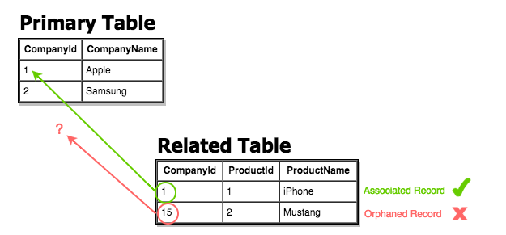

# Referential Integrity
Referential integrity refers to the accuracy and consistency of data within a relationship. In relationships, data is linked between two or more tables. This is achieved by having the **foreign key** (in the associated table) reference a **primary key** value (in the primary – or parent – table).

In relational databases, data is linked between two or more tables.  This is achieved by having the **foreign key** (in the associated table) reference a **primary key value** (in the primary – or parent – table). 

Referential integrity regards ensuring that this data on both sides of the relationship stays intact. e should only be able to delete a *primary key* if there are no associated records. Otherwise, we would end up with an orphaned record like in the example below.



>*Here the Related Table contains a foreign key value that doesn't exist in the primary key field of the primary table, hence it has become an "orphaned record" which is not allowed.*

### Consequences of a Lack of Referential Integrity 
Since eferential integrity guarantees that the target 'referred' to will be found. A lack of referential integrity in a database can lead relational databases to return incomplete data, usually with no indication of an error.

## Example: Enforcing Referential Integrity
 We can enforce referential integrity by ensuring that all referencing columns are defined as foreign keys with the proper table, column reference and selecting the appropriate `ON UPDATE`, `ON DELETE` behaviors.

1. Create the following tables in a new SQL editor in DBeaver:
```sql
DROP TABLE soccer_teams;
DROP TABLE cities;

CREATE TABLE IF NOT EXISTS cities (
	id SERIAL PRIMARY KEY,
	city_name VARCHAR(30)
);

CREATE TABLE IF NOT EXISTS soccer_teams (
	id SERIAL PRIMARY KEY,
	team_name VARCHAR(40) NOT NULL,
	team_location INTEGER REFERENCES cities(id) ON DELETE SET DEFAULT
);
```

* Notice that upon creating the soccer_teams table, we are setting the behavior for `ON DELETE` which would be `ON DELETE NO ACTION` by default.
* By enciting `ON DELETE NO ACTION` we **defer enforcement of referential integrity**, but will eventually throw and error if referential integrity is not maintained.  We are commiting bad practice on prupose to demonstrate the consequences.

Some more ways that we can effect referential integrity include:
* `ON DELETE RESTRICT` - Prevents deletion of any referenced row which has a reference pointing to it from this column. Maintains referential integrity.
* `ON DELETE CASCADE` - When a referenced row is deleted, referencing row from this table is also deleted.  **This maintains referential integrity**.
* `ON DELETE SET NULL` - When a referenced row is deleted, referencing row has column replaced with null.
* `ON DELETE SET DEFAULT` - Replaces the column value with a default value for the column.

2. Insert the following records to demonstrate the ways in which we can manipulate referential integrity:
```sql
INSERT INTO cities (city_name) VALUES ('Barcelona'), ('Madrid'), ('London'), ('Tucuman'), ('Manchester'), ('San Paolo');
INSERT INTO soccer_teams (team_name, team_location) VALUES
	('Real Madrid', (SELECT id FROM cities WHERE city_name LIKE 'Mad%')),
	('Manchester United', (SELECT id FROM cities WHERE city_name LIKE 'Man%')),
	('FC Barcelona', (SELECT id FROM cities WHERE city_name LIKE 'Bar%'));

DELETE FROM cities WHERE id = 2;
SELECT * FROM cities;
SELECT * FROM soccer_teams;
```


### References
* [PSQL Referential Integrity](https://wiki.postgresql.org/wiki/Referential_Integrity_Tutorial_%26_Hacking_the_Referential_Integrity_tables)
